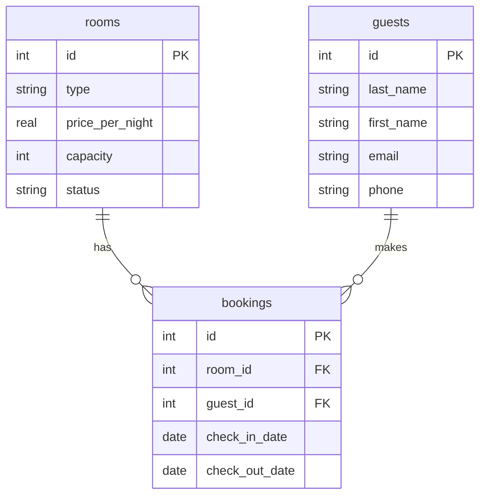

# Практична робота 3
## Створення ER-діаграм для заданих прикладів

**Варіант №6 — Готель**

---

## Завдання 1. ER-діаграма повної схеми

Моя предметна область — готель.

У роботі використовуються три таблиці:

- `rooms` — таблиця-вимір 1;
- `guests` — таблиця-вимір 2;
- `bookings` — фактова таблиця.



Таблиця `rooms` містить інформацію про номери готелю.

Таблиця `guests` містить інформацію про гостей.

Таблиця `bookings` містить інформацію про бронювання номерів і зв'язує номер з конкретним гостем.

---

## Завдання 2. Тип кожного зв'язку

### Зв'язок rooms — bookings

Цей зв'язок має тип **1:N**.

Один номер може мати багато бронювань у різні дати або не мати жодного бронювання. При цьому кожне бронювання стосується тільки одного номера.

```text
rooms ||--o{ bookings
```

### Зв'язок guests — bookings

Цей зв'язок також має тип **1:N**.

Один гість може зробити багато бронювань або не мати жодного. Кожне конкретне бронювання належить одному гостю.

```text
guests ||--o{ bookings
```

Прямого зв'язку між `rooms` і `guests` немає. Вони пов'язані через таблицю `bookings`.

---

## Завдання 3. Первинні й зовнішні ключі кожної таблиці

### Таблиця rooms

Первинний ключ:

- `id`

Зовнішні ключі:

- немає.

### Таблиця guests

Первинний ключ:

- `id`

Зовнішні ключі:

- немає.

### Таблиця bookings

Первинний ключ:

- `id`

Зовнішні ключі:

- `room_id` → `rooms.id`
- `guest_id` → `guests.id`

Отже, таблиця `bookings` має один первинний ключ і два зовнішні ключі.

---

## Завдання 4. Якщо додати ще одну сутність

До предметної області «Готель» можна додати сутність `hotels`.

Нова таблиця може мати такі стовпці:

```text
hotels(id, name, address, city, phone)
```

До таблиці `rooms` можна додати зовнішній ключ:

```text
hotel_id → hotels.id
```

Зв'язок між `hotels` і `rooms` буде **1:N**, тому що один готель може мати багато номерів, а кожен номер належить одному готелю.

На ER-діаграмі з'явиться зв'язок:

```text
hotels ||--o{ rooms
```

---

## Завдання 5. Порівняння з прикладом

Моя діаграма схожа на діаграму хімчистки з прикладу.

У хімчистці є дві вимірні таблиці `services` і `clients` та фактова таблиця `orders`.

У моєму варіанті є дві вимірні таблиці `rooms` і `guests` та фактова таблиця `bookings`.

В обох випадках фактова таблиця має два зовнішні ключі.

Також в обох випадках обидва зв'язки мають тип **1:N**.

У хімчистці одна послуга може бути в багатьох замовленнях, а один клієнт може мати багато замовлень.

У готелі один номер може мати багато бронювань, а один гість може мати багато бронювань.

Дві вимірні таблиці не пов'язані між собою напряму. Вони пов'язані через фактову таблицю.

---

# Контрольні питання

## 1. Чим логічна модель відрізняється від концептуальної, і чим фізична — від логічної?

Концептуальна модель показує предметну область у загальному вигляді: які сутності існують і як вони пов'язані між собою.

Логічна модель вже описує таблиці, стовпці, первинні та зовнішні ключі і зв'язки між таблицями.

Фізична модель показує, як логічна модель буде реалізована в конкретній СУБД. Тут визначаються конкретні типи даних, обмеження, індекси та інші параметри.

Отже:

**концептуальна → логічна → фізична**

---

## 2. Чому зв'язок M:N не можна реалізувати двома зовнішніми ключами в одній із двох основних таблиць і завжди потрібна окрема таблиця?

Зв'язок M:N означає, що один запис першої таблиці може бути пов'язаний з багатьма записами другої таблиці, і навпаки.

Двох зовнішніх ключів в одній таблиці для цього недостатньо, тому що вони не дозволяють зберегти довільну кількість зв'язків.

Тому створюється окрема проміжна таблиця. Вона містить зовнішні ключі на обидві основні таблиці.

Наприклад:

```text
students
    |
    | 1:N
    |
student_courses
    |
    | N:1
    |
courses
```

Проміжна таблиця може містити:

```text
student_id → students.id
course_id → courses.id
```

Таким чином, зв'язок M:N перетворюється на два зв'язки 1:N.

---

## 3. Що означають позначення ||, o{, |{ у синтаксисі mermaid erDiagram, і як прочитати вголос рядок A ||--o{ B?

У Mermaid:

- `||` означає рівно один;
- `o{` означає нуль або багато;
- `|{` означає один або багато.

Рядок:

```text
A ||--o{ B
```

читається як:

**один A пов'язаний з нулем або багатьма B.**

У моїй діаграмі:

```text
rooms ||--o{ bookings
```

означає, що один номер може мати нуль або багато бронювань.

А:

```text
guests ||--o{ bookings
```

означає, що один гість може мати нуль або багато бронювань.

---

## Висновок

У цій практичній роботі я спроєктував ER-діаграму для предметної області «Готель».

Було використано дві таблиці-виміри `rooms` і `guests` та одну фактову таблицю `bookings`.

Таблиця `bookings` має два зовнішні ключі:

- `room_id` → `rooms.id`;
- `guest_id` → `guests.id`.

Обидва зв'язки мають тип 1:N.

Також було розглянуто додавання нової сутності `hotels` та відповіді на контрольні питання.

У цій практичній роботі SQL-код не використовувався і файл бази даних не змінювався.
